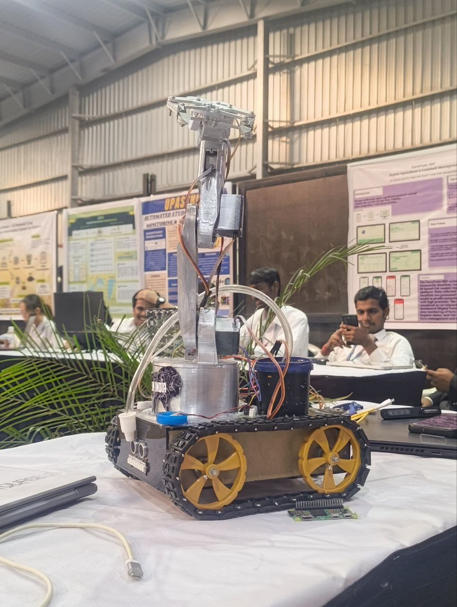
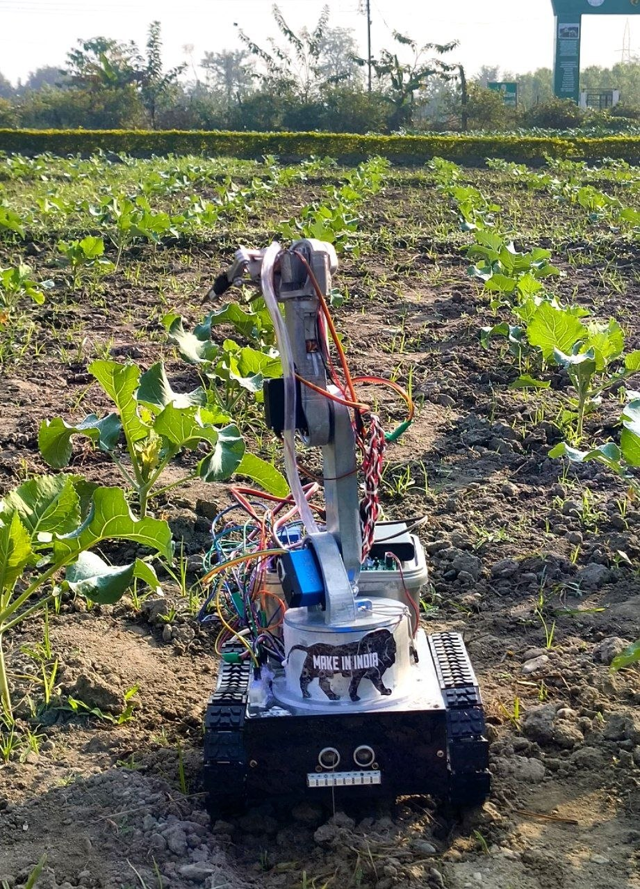
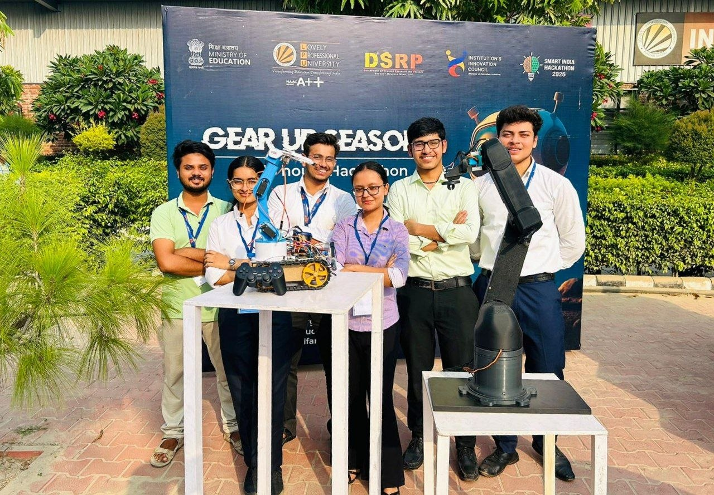

# AgriBot: Intelligent Pesticide Sprinkler Robot

  
  

  

# Dr. Kisaan 🌱

### AI-Powered Autonomous Farming & Plant Healthcare Robot

## Overview

Dr. Kisaan is an intelligent autonomous agricultural robot designed to monitor crop health, detect plant diseases at early stages, and perform precision treatment with minimal human intervention. By combining robotics, AI, IoT, cloud computing, and environmental sensing, the system helps farmers improve crop yield, reduce pesticide usage, and enable smart farm management.

The robot autonomously navigates through crop rows while continuously collecting real-time environmental and plant health data using multiple sensors and AI-powered vision systems.

---

## Key Features

### Autonomous Navigation

* Obstacle-free autonomous movement through crop rows
* Smart path planning for efficient field coverage

### Multi-Modal Plant & Soil Monitoring

* Soil moisture sensor
* Soil pH sensor
* Bosch BME688 environmental sensor for:

  * Temperature
  * Humidity
  * Gas monitoring
* E-Nose VOC sensor for early disease detection
* Edge-AI camera for real-time leaf analysis

### Smart Irrigation Support

* Humidifier-based water mist spraying during low moisture conditions
* Maintains optimal hydration for crops

### AI-Based Disease Detection

* AI Severity Index classifies infection stages into:

  1. Early Infection Stage
  2. Primary/Moderate Infection Stage
  3. Secondary/Severe Infection Stage

### Automated Treatment System

* Precision pesticide spraying
* Laser sterilization for infected leaves
* Robotic excision of severely infected plant portions
* Daily recovery monitoring using closed-loop feedback

---

## Cloud Dashboard & Smart Analytics 

Dr. Kisaan uploads all real-time data through Wi-Fi or LoRa connectivity to a cloud-based dashboard providing:

* Plant health monitoring
* Soil health analysis
* Irrigation logs
* Disease heatmaps
* Outbreak prediction
* Crop care suggestions
* Pesticide usage reports
* Cost efficiency tracking

### Dashboard Visualizations

* Plant Health Heatmaps
* AI Disease Analysis Panel
* Resource Tracking Dashboard
* Real-time Sensor Data Display
* Historical Graphs & Charts using Chart.js

---

## AI Assistant & Farmer Support 

* Multilingual chatbot supporting 10+ languages
* Customized pesticide recommendations
* Voice assistant integration powered by ElevenLabs AI
* Real-time voice-based updates and interactions

---

## Collaborative Intelligent Network (CIN) 

Multiple Dr. Kisaan units can communicate and share environmental data to:

* Detect regional disease outbreaks early
* Send real-time community alerts
* Help farmers take preventive measures before infection spreads

---

## Night Surveillance & Farm Security 

Equipped with a NoIR night vision camera for:

* Night-time crop monitoring
* Pest detection
* Animal intrusion detection
* Farm security surveillance

---

## Technologies Used

### Hardware

* 6-DOF Robotic Arm
* Edge-AI Camera
* Bosch BME688 Sensor
* Soil Moisture & pH Sensors
* E-Nose VOC Sensor
* NoIR Night Vision Camera
* Humidifier System

### Software & AI

* Machine Learning Models
* Edge AI Processing
* Cloud Dashboard
* Chart.js
* LoRa & Wi-Fi Communication
* ElevenLabs Voice AI

---

## Objectives

* Reduce excessive pesticide usage
* Improve crop yield and plant health
* Enable early disease detection
* Minimize labor costs
* Promote precision agriculture and smart farming

---

## Future Enhancements

* Solar-powered charging system
* Swarm robotics integration
* Advanced predictive disease analytics
* Mobile application for remote control
* GPS-based farm mapping

---
